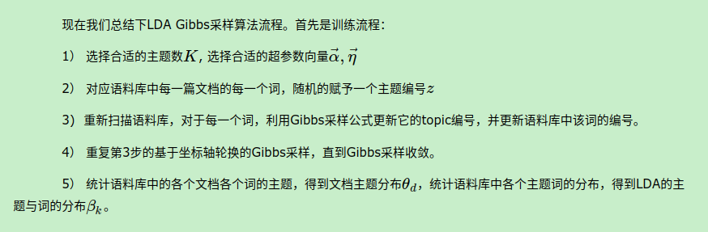
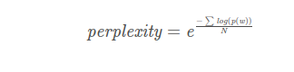
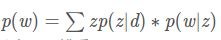
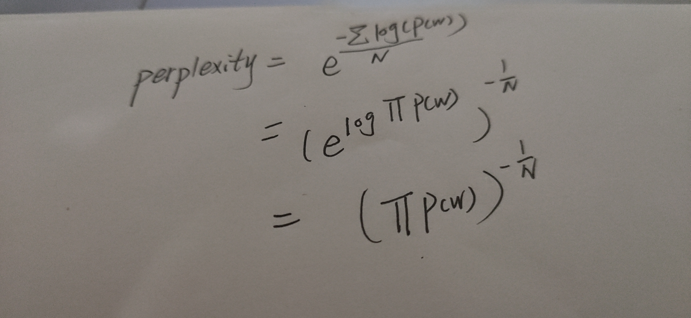

### 一.文档分析方法
1. 根据词频，tf-idf值等统计量将文档向量化，再通过向量的距离定义文档的相似度...

    评价：无法解决一词多义，一义多词现象对结果的影响。 

2. 潜在语义分析LSA/LSI（Latent Semantic Analysis/Indexing） ,通过矩阵奇异值分解方法将m\*n的矩阵分解成3个子矩阵m\*k,
k\*k,k\*n。 第一个矩阵表示文档与潜在语义的关系；第二个矩阵是一个对角矩阵，表示各个潜在的语义的权重；第三个矩阵表示单词和语义的关系；

    评价：一定程度解决了一词多义，一义多词的问题； 局限性：算法简单，矩阵分解计算耗时，潜在语义数量k的选择对结果的影响非常大，
    没有统计基础，矩阵分解得到的负值无法解释，难以对应现实中的概念。
    
3.主题模型：主题模型认为一篇文档由若干个主题构成，而每个主题也可以表示为词汇的概率分布。

3.1   前提假设：（1）词袋模型，不考虑文档中词的顺序；（2）文档的主题分布服从多项分布，主题的词分布服从多项分布。

3.2  文档生成模型：对于每篇文档，主题模型这样解释它的产生：

      （1）： 确定单词数n；
      （2）：从主题的概率分布中，随机采样产生一个主题t；
      （3）：从主题t的词分布中，随机采样产生一个单词w；
      （4）：重复过程（2）和（3）n次，直到文档中的单词全部生成；
   
3.3 PLSA(Probabilitistic Latent Semantic Analysis),1999年提出，模型参数包括（K,主题分布的参数,词分布的参数），求解方法
列出语料库的似然函数，通过EM算法最大化似然函数。

3.4 LDA( Latent Dirichlet Allocation) , 2003年提出， 在PLSA的基础上加入dirichlet分布作为多项分布先验分布，引入新的
先验超参数alpha和beta。求解方法有Gibbs采样，变分推断等。

3.5 LDA和PLSA比较。 先验参数为0的LDA就是PLSA， 数据量特别大两者结果无限接近。 
     LDA的优势：通过先验参数的设置，LDA在数据量比较小的时候效果比PLSA更好；在有新的数据产生时，LDA不需要重新推导（在线模型）。
          
###二.LDA的gibbs采样



1. 输入：文档集合， 参数 k，alpha，beta，niters； 输出：文档-主题的分布矩阵，主题-单词的分布矩阵。
2. 核心代码实现：
```java
     
//初始化算法需要的各个数据结构。 

public boolean initNewModel() {


        int m, n, w, k;
        //+ allocate memory and assign values for variables
        M = data.getDocs().size();
        V = data.getDictionary().getId2word().size();

    

        nw = new int[V][K]; //每个单词被分配不同主题的计数
        for (w = 0; w < V; w++) {
            for (k = 0; k < K; k++) {
                nw[w][k] = 0;
            }
        }

        nd = new int[M][K]; //每个文档的主题计数
        for (m = 0; m < M; m++) {
            for (k = 0; k < K; k++) {
                nd[m][k] = 0;
            }
        }

        nwsum = new int[K]; //每个主题下单词总数
        for (k = 0; k < K; k++) {
            nwsum[k] = 0;
        }

        ndsum = new int[M];  //每个文档下单词总数
        for (m = 0; m < M; m++) {
            ndsum[m] = 0;
        }

        z = new Vector[M]; //每个单词的主题指定
        for (m = 0; m < M; m++) {
            int N = data.getDocs().get(m).size();
            z[m] = new Vector<Integer>();

            //initilize for z
            for (n = 0; n < N; n++) {
                int topic = (int) Math.floor(Math.random() * K);
                z[m].add(topic);

                // number of instances of word assigned to topic j
                nw[data.getDocs().get(m).get(n)][topic] += 1;
                // number of words in document i assigned to topic j
                nd[m][topic] += 1;
                // total number of words assigned to topic j
                nwsum[topic] += 1;
            }
            // total number of words in document i
            ndsum[m] = N;
        }
        theta = new double[M][K];
        phi = new double[K][V];
        return true;
    }
```

```java

//算法主体部分
 public void estimate() {
        Logger log = LoggerFactory.getLogger(LDAModel.class);

        log.info("Sampling " + niters + " iteration!");


        for (int i = 0; i < niters; i++) {
            log.info("Iteration " + i + " ...");

            // for all z_i
            for (int m = 0; m < M; m++) {
                for (int n = 0; n < data.getDocs().get(m).size(); n++) {
                    // z_i = z[m][n]
                    // sample from p(z_i|z_-i, w)
                    int topic = sampling(m, n);
                    z[m].set(n, topic);
                }// end for each word
            }// end for each document
        }
        computeTheta();
        computePhi();
        this.perplexity = perplexity();
        this.topics = print_topics();
    }

//计算 文档主题分布矩阵

    private void computeTheta() {
        for (int m = 0; m < M; m++) {
            for (int k = 0; k < K; k++) {
                theta[m][k] = (nd[m][k] + alpha) / (ndsum[m] + K * alpha);
            }
        }
    }
//计算 主题词的分布矩阵
    private void computePhi() {
        for (int k = 0; k < K; k++) {
            for (int w = 0; w < V; w++) {
                phi[k][w] = (nw[w][k] + beta) / (nwsum[k] + V * beta);
            }
        }
    }


```

```java
//采样 第m篇文档的第n个单词的主题
private int sampling(int m, int n) {
        // remove z_i from the count variable

        double[] p = new double[K];

        int topic = z[m].get(n);
        int w = data.getDocs().get(m).get(n);

        nw[w][topic] -= 1;
        nd[m][topic] -= 1;
        nwsum[topic] -= 1;
        ndsum[m] -= 1;

        double Vbeta = V * beta;
        double Kalpha = K * alpha;

        //do multinominal sampling via cumulative method
        for (int k = 0; k < K; k++) {
            p[k] = (nw[w][k] + beta) / (nwsum[k] + Vbeta) *
                    (nd[m][k] + alpha) / (ndsum[m] + Kalpha);
        }

        // cumulate multinomial parameters
        for (int k = 1; k < K; k++) {
            p[k] += p[k - 1];
        }

        // scaled sample because of unnormalized p[]
        double u = Math.random() * p[K - 1];

        for (topic = 0; topic < K; topic++) {
            if (p[topic] > u) //sample topic w.r.t distribution p
                break;
        }

        // add newly estimated z_i to count variables
        nw[w][topic] += 1;
        nd[m][topic] += 1;
        nwsum[topic] += 1;
        ndsum[m] += 1;

        return topic;
    }


```


### 三.困惑度perplexity 
   
其中w代表文章d中一个特定单词，N代表语料库所有的单词总数。
每一个单词的概率可以根据主题模型参数theta和phi计算求得：
。


做一些简单的数学变换，可以看出其等价于给定模型的参数，各个单词产生概率的几何平均数的倒数。 类似频率派的极大似然估计的思想，单词产生的平均概率越大，模型的困惑度越低，模型越好。



对应java代码
```java
 public double perplexity() {
        int N = 0;
        double count = 0;
        for (int i = 0; i < data.getDocs().size(); i++) {
            double mul = 0;
            for (int word : data.getDocs().get(i)) {
                double sum = 0;
                for (int k = 0; k < K; k++) {
                    sum = sum + phi[k][word] * theta[i][k];
                }
                mul = mul + Math.log(sum);

            }
            count += mul;
            N += data.getDocs().get(i).size();
        }
        count = 0 - count;
        double p = Math.exp(count / N);
        return p;
    }

```

